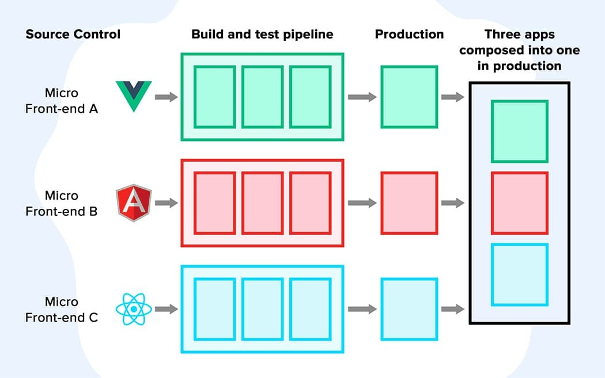

# 🧩Micro-Front-End


**Micro frontends** is an architectural style where independently deliverable frontend applications are composed into a greater whole. 

Each frontend is a self-contained unit, allowing ***teams to work independently*** and use ***different technologies***. 

This approach enables the ***development, testing, and deployment*** of individual parts of the user interface, providing flexibility and scalability in large and complex web applications.


<p align="center">

</p>


# 📚 POC Summary :

1. [Introduction to Micro Frontends and Module Federation](#intro)
2. [Setting up the First Remote App with React](#react-remote)
3. [Setting up the Second Remote App with Vue](#vue-remote)
4. [Setting up the Third Remote App with Angular](#angular-remote)
5. [Setting up the Host App with React and Integrating Remote Apps](#react-host)
6. [Conclusion and Next Steps](#conclusion)

---

##  <span id="intro">1- Introduction to Micro Frontends and Module Federation</span>

This Proof of Concept (POC) demonstrates the implementation of micro front-ends using **module federation**. 

The project comprises a ***React app as the host***, with three remote apps built in ***Angular, React, and Vue***. 

This approach showcases how different front-end frameworks can be seamlessly integrated into a single application, allowing for independent development and deployment of each micro front-end. 

By leveraging module federation and technologies like Vite, this POC highlights the potential for creating scalable and maintainable front-end architectures.


<p align="center">

</p>

We’ll be using ***web components*** to share some of the components and importing and displaying the different remotes in the host app in different ways.

##  <span id="react-remote">2- Setting up the First Remote App with React</span>

To set up the first remote React app, we can leverage the fact that our host app is also a React app, making the process relatively straightforward. First, create a new React app using Vite by running the following command:

````bash
npm create vite@latest [app-name]
````

Once the app is created, we'll need to install the @originjs/vite-plugin-federation package to enable module federation for our remote app. This can be done by running the following command:

````bash
npm install @originjs/vite-plugin-federation --save-dev
````

### Update vite.config : 

````ts
import { defineConfig } from 'vite';
import react from '@vitejs/plugin-react';
import federation from '@originjs/vite-plugin-federation';

export default defineConfig({
  plugins: [
    react(),
    federation({
      name: 'reactApp',
      filename: 'remoteEntry.js',
      exposes: {
        './AppReact': './src/App.tsx',
      },
      shared: ['react', 'react-dom'],
    }),
  ],
  build: {
    modulePreload: false,
    target: 'esnext',
    minify: false,
    cssCodeSplit: false,
  },
});
````

1. **name: 'reactApp'**: This specifies the name of the remote app, which will be used to identify it within the module federation system.
   
2. **filename: 'remoteEntry.js'**: This sets the filename for the remote entry point, which is the file that exposes the remote modules and is used by the host app to consume those modules.
   
3. **exposes: { './AppReact': './src/App.tsx' }**: Here, we define which components or modules the remote app will expose to the host. In this example, the remote app exposes the ***App.tsx*** file as ***AppReact*** to be consumed by the host app.


4. **shared: ['react', 'react-dom']**: This specifies the dependencies that the remote app wants to share with the host and potentially with other remote apps. In this case, the remote app shares the react and react-dom dependencies.


In summary, the federation part configures the remote app to participate in the module federation system, defining its name, the entry point filename, the components to expose, and the shared dependencies. This enables the remote app to seamlessly integrate with the host app and other remote apps within the module federation architecture.

### Update package.json : 
````json
"scripts": {
    "dev": "vite --port 5173 --strictPort",
    "build": "tsc -b && vite build",
    "lint": "eslint .",
    "preview": "vite preview --port 5173 --strictPort"
  },
````
Another last thing, by specifying the port using ***--port 5173*** and ***--strictPort*** in the scripts, we ensure that the remote app runs on a dedicated port that won't clash with other applications in the system.

As Vite is built on esbuild in dev development mode, Only the Host side supports dev mode, the Remote side requires the ***RemoteEntry.js*** package to be generated using vite build. This is because Vite Dev mode is Bundleless and you can use vite build --watch to achieve a hot update effect.

So to be able to use the exposed component on the host you need to build : 

````bash
npm run build
````

Then preview: 

````bash
npm run preview
````


##  <span id="vue-remote">3- Setting up the Second Remote App with Vue</span>
To set up the second remote Vue app, we will follow a similar approach as with the remote React app , we are not going to go on all the steps , it's almost the same.

We need to create a new Vue app using Vite and then install the ***@originjs/vite-plugin-federation*** package to enable module federation for the remote Vue app.

When setting up the second remote Vue app, the primary difference lies in the integration between Vue and React due to their distinct ecosystems. 

While the first remote app with React could expose components directly, the transition to a Vue app requires a universal standard for cross-framework interoperability. 

In this case, the solution is to utilize custom elements, providing a standardized approach that can be understood by all applications.

what we did is , we added a new file called **boot.ts** and did some config : 

````ts
import { defineCustomElementSFC } from 'vue-web-component-wrapper';
import App from './App.vue';

export default function register() {
  const element = defineCustomElementSFC(App, { shadowRoot: false });

  if (!customElements.get('vue-app')) {
    customElements.define('vue-app', element);
  }
}
````

In the provided code snippet, we used the ***vue-web-component-wrapper*** library to register a Vue component as a custom element. 

This approach addresses the challenge of integrating Vue components with a React host application. 

By using the ***defineCustomElementSFC*** function from ***vue-web-component-wrapper***, we were able to define the Vue component as a custom element and register it with a specific tag name, allowing for seamless integration within the host application. 

This method overcomes the **limitations** of directly exposing Vue components, such as the absence of styles and the inability to modify the component's styling from the host app. 

Now we can expose our component like we did for the first remote React app : 

````ts
import { defineConfig } from 'vite';
import vue from '@vitejs/plugin-vue';
import federation from '@originjs/vite-plugin-federation';

export default defineConfig({
  plugins: [
    vue(),
    federation({
      name: 'vueApp',
      filename: 'remoteEntry.js',
      exposes: {
        './AppVue': './src/boot.ts',
      },
      shared: ['vue'],
    }),
  ],
  build: {
    target: 'esnext',
    minify: false,
    cssCodeSplit: false,
  },
});
````

And we can do the same thing that we did in the Remote React App for the ***package.json***.


##  <span id="angular-remote">4- Setting up the Third Remote App with Angular</span>

When setting up the third remote app with Angular, a notable difference is the utilization of the ***angular-architects/module-federation*** plugin to incorporate Module Federation into the app. 

This approach involves generating a ***webpack.config.js*** file instead of a vite.config file, as the **vite-plugin-federation is not yet supported for Angular apps**. 

Additionally, the Angular ecosystem currently relies heavily on Webpack for module bundling and build processes, making the integration of Module Federation more seamless within the existing infrastructure. 

After creating our angular app first thing to do is to create a custom element of the compnent that we want to expose for our case we want the app.component , to do that in the app.module.ts we do : 

````ts
import { Injector, NgModule } from '@angular/core';
import { CommonModule } from '@angular/common';
import { AppComponent } from './app.component';
import { BrowserModule } from '@angular/platform-browser';
import { createCustomElement } from '@angular/elements';

@NgModule({
  declarations: [AppComponent],
  imports: [CommonModule, BrowserModule],
  providers: [],
  bootstrap: [AppComponent],
})
export class AppModule {
  constructor(private injector: Injector) {
    const element = createCustomElement(AppComponent, { injector: injector });

    if (!customElements.get('angular-remote-app')) {
      customElements.define('angular-remote-app', element);
    }
  }
}
````

In this Angular module, the code snippet demonstrates the creation of a custom element using Angular's ***createCustomElement*** function. 

- The ***AppModule*** utilizes Angular's dependency injection system to access the Injector instance. 

- Within the constructor, the ***createCustomElement*** function is employed to define a custom element from the AppComponent, which represents the Angular component to be encapsulated. 

- By providing the ***Injector*** instance, the custom element is equipped with the necessary dependencies for seamless integration within the host application. 

- The conditional check ensures that the custom element with the tag name 'angular-remote-app' is defined only if it does not exist, preventing potential conflicts. 

After that we created a file called ***loadApp.ts*** :

````ts
import 'zone.js';
import { platformBrowserDynamic } from '@angular/platform-browser-dynamic';
import { AppModule } from './app/app.module';

const mount = () => {
  platformBrowserDynamic()
    .bootstrapModule(AppModule)
    .catch((err) => console.error(err));
};

export { mount };
````

This file serves as the entry point for the Angular remote app, defining the process of bootstrapping the Angular module and mounting it within the host application. 

- The inclusion of ***zone.js*** ensures the proper functioning of Angular's Zone.js library, which is essential for managing asynchronous tasks and detecting changes within the Angular application. 

- The ***platformBrowserDynamic*** function initiates the dynamic platform for running the Angular application within a web browser, while ***AppModule*** represents the root module of the Angular app. 

- The ***mount*** function orchestrates the bootstrapping process, ensuring that the Angular module is correctly initialized and ready for integration with the host application. 


Final step is to add our federation config in the ***webpack.config.js***: 

````js
const {
  shareAll,
  withModuleFederationPlugin,
} = require("@angular-architects/module-federation/webpack");

module.exports = withModuleFederationPlugin({
  name: "angularApp",
  filename: "remoteEntry.js",
  exposes: {
    "./Component": "./src/loadApp.ts",
  },

  shared: {
    ...shareAll({
      singleton: true,
      strictVersion: true,
      requiredVersion: "auto",
    }),
  },
});
````
You can run directly :

````bash
ng serve
````

Since you can test directly with dev mode with module federation using webpack.

##  <span id="react-host">5- Setting up the Host App with React and Integrating Remote Apps</span>

In this final step, we will set up the ***host app using React*** and integrate the remote apps that we have created, including the remote app built in ***Angular*** and the remote app built in ***Vue*** and ***React***. 

This will involve configuring the host app to consume the exposed components from the remote apps using ***module federation***. 

By leveraging the module federation capabilities, we can seamlessly combine and orchestrate the different front-end frameworks within the host app, allowing for independent development and deployment of each micro frontend. 

The host app will act as the container for these remote apps, enabling a unified and cohesive user experience while leveraging the strengths of each technology stack.

So, we will create a React host app using Vite and integrate the remote apps by configuring module federation. 

While we install the Vite module federation plugin as we did for the remote apps, the key difference is that as the host app, we can directly run it in development mode to test the integration with the remote apps.

first thing we need to configure the module federation: 

````ts
import { defineConfig } from 'vite';
import react from '@vitejs/plugin-react';
import federation from '@originjs/vite-plugin-federation';

export default defineConfig({
  plugins: [
    react(),
    federation({
      name: 'hostApp',
      remotes: {
        reactApp: 'http://localhost:5173/assets/remoteEntry.js',
        vueApp: 'http://localhost:5174/assets/remoteEntry.js',
        angularApp: 'http://localhost:4201/remoteEntry.js',
      },
      shared: ['react', 'react-dom'],
    }),
  ],
  build: {
    modulePreload: false,
    target: 'esnext',
    minify: false,
    cssCodeSplit: false,
  },
});
````

The federation plugin is utilized to define the remotes, specifying the ***URLs*** for each remote app's ***remoteEntry.js*** file. By identifying the remotes for the ***React, Vue, and Angular*** apps along with the shared dependencies, we enable the host app to dynamically consume and interact with the remote apps.

Now we just need to import , and use them inside our app: 

#### For the ***React remote app*** as it is as the host app we can directly do : 

````ts
import ReactApp from 'reactApp/AppReact';
... 
return <ReactApp />
...
````

#### For the ***Vue remote app*** we created a new file VueApp.jsx : 

````ts
import React, { useEffect } from 'react';
import mount from 'vueApp/AppVue';

function VueApp() {
  useEffect(() => {
    mount();
  }, []);

  return <vue-app />;
}

export default VueApp;
````

Then to use it : 

````ts
import VueApp from './components/VueApp/VueApp';
... 
return <VueApp />
...
````
#### For the ***Angular remote app*** we created a new file AnularApp.jsx : 

````ts
import React, { useEffect } from 'react';
import { mount } from 'angularApp/Component';

const AngularApp = () => {
  useEffect(() => {
    mount();
  }, []);
  return (
    <div className='angular-remote-app'>
      <app-root></app-root>
    </div>
  );
};

export default AngularApp;
````

Then to use it : 

````ts
import AngularApp from './components/AngularApp/AngularApp';
... 
return <AngularApp />
...
````
---
The reason for importing and mounting the remote Vue and Angular apps within React components is to enable seamless integration and interoperability between the different front-end frameworks. 

By encapsulating the mounting logic within React components, we can ensure that the remote Vue and Angular apps are correctly initialized and integrated within the host app's environment.

Additionally, the imported remote Vue and Angular apps are utilized within React components through their custom elements, which were created and exposed in the respective remote apps.

---


Finally , Running npm run dev will launch the host application , and you can see all the magic ✨✨✨

````bash
npm run dev
````

##  <span id="conclusion">6- Conclusion and Next Steps</span>
In conclusion, this Proof of Concept (POC) demonstrated the integration of micro frontends using module federation, showcasing the seamless coexistence of remote apps built in distinct front-end frameworks within a single host application. 

By leveraging technologies such as Vite, module federation, and custom elements, we illustrated the potential for scalable and maintainable front-end architectures. 

However, it's important to note that this POC serves as a foundational exploration and visualization of micro-frontend architecture. 

It also highlights potential challenges that may arise when further developing and scaling such an architecture. 

While this POC provides a glimpse into the possibilities, it's clear that extensive considerations and refinements are required for more comprehensive implementation in real-world scenarios.

## 🙇 Reference and documentation

- Micro-Front-End
  - [vite-plugin-federation](https://github.com/originjs/vite-plugin-federation).
  - [@angular-architects/module-federation](https://www.npmjs.com/package/@angular-architects/module-federation).  
  - [The Microfrontend Revolution: Module Federation with Angular](https://www.angulararchitects.io/blog/the-microfrontend-revolution-part-2-module-federation-with-angular/).
  - [vue-web-component-wrapper
](https://github.com/EranGrin/vue-web-component-wrapper).
  - [Vue and Web Components](https://vuejs.org/guide/extras/web-components).
  - [module-federation-angular-react-vue-hosts-remotes](https://github.com/joemoceri/module-federation-angular-react-vue-hosts-remotes).